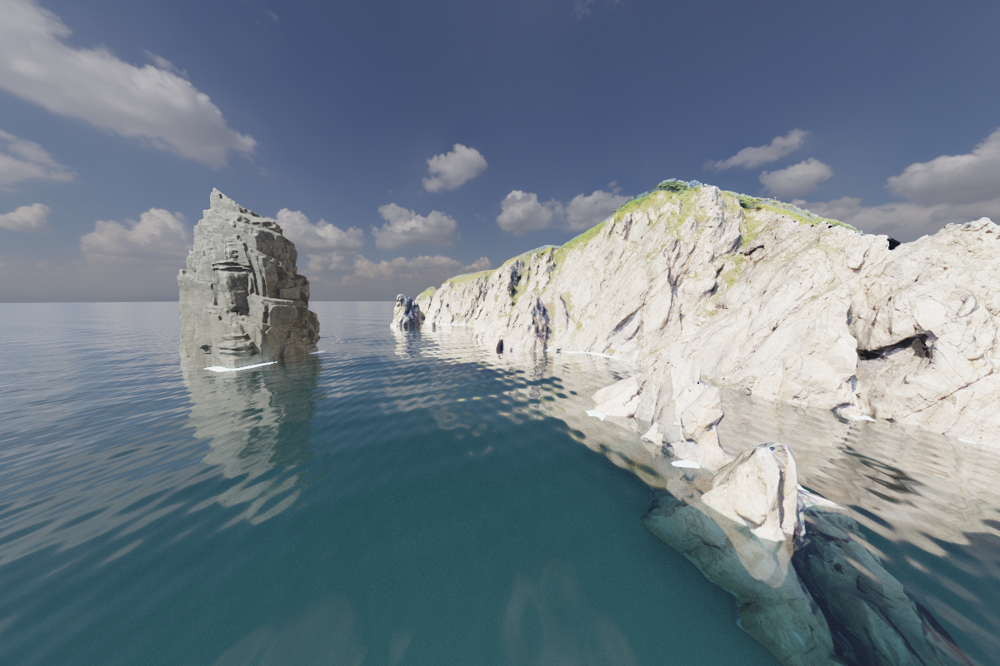
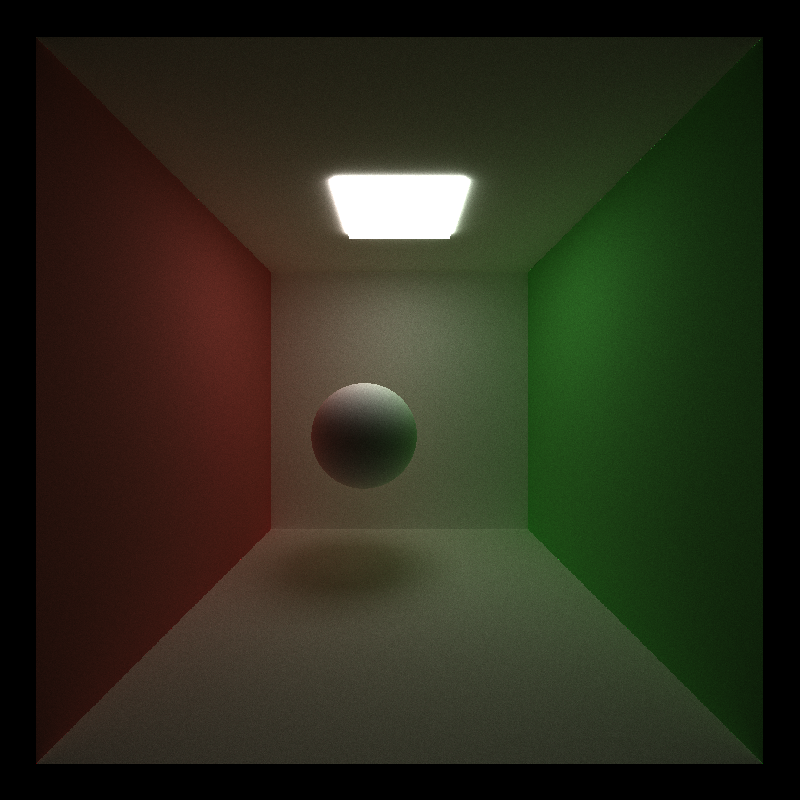
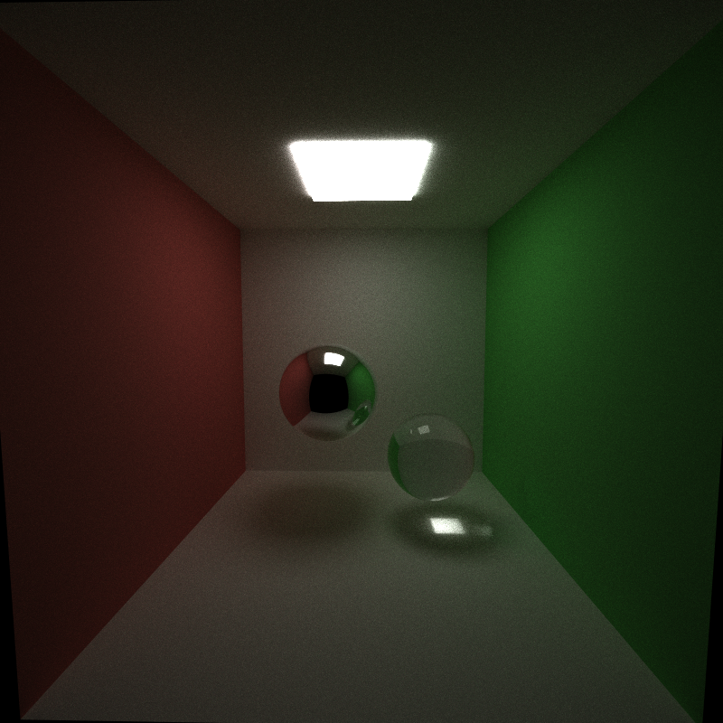
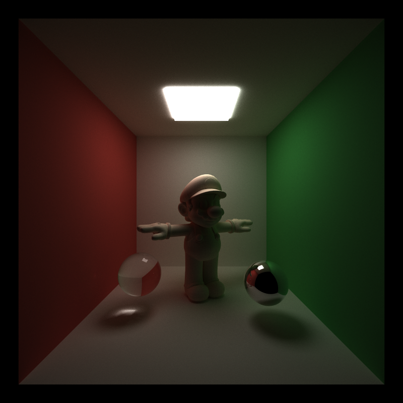
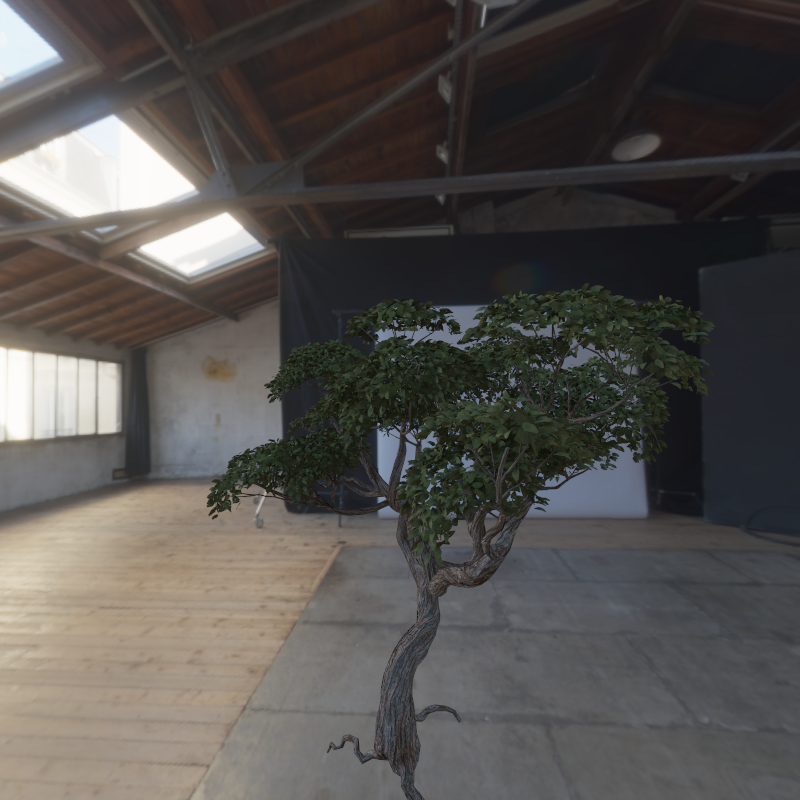
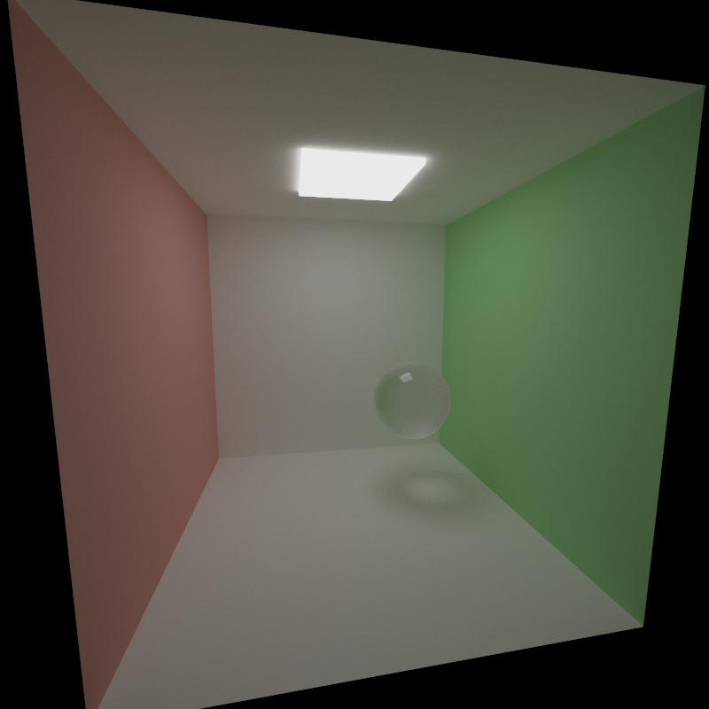
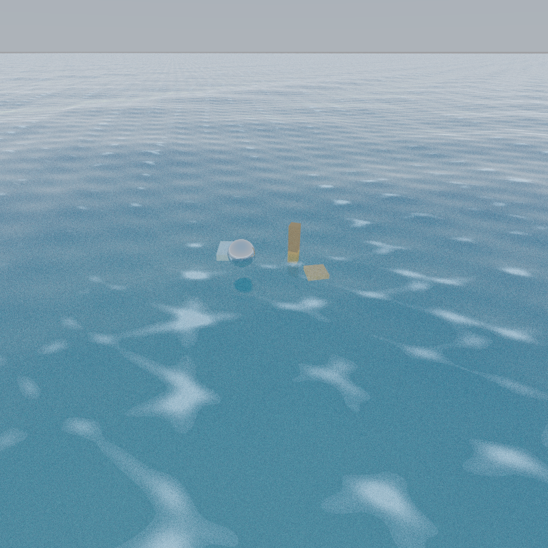
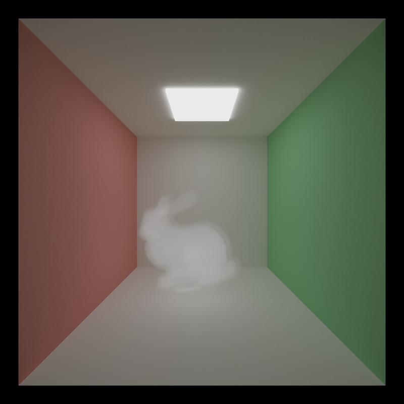

# CUDA Path Tracer

A research-oriented physically based renderer built in CUDA/C++ with an emphasis on end-to-end graphics systems work: scene loading, glTF asset ingestion, GPU acceleration structures, Monte Carlo light transport, physically based materials, participating media, animated water, and interactive tooling.

This project began from a path tracing foundation and was extended into a compact rendering sandbox for studying how modern GPU renderers combine geometry processing, sampling strategies, material models, volumes, and artist-facing controls in one coherent system.

<p align="center">
  <a href="coastline.mp4">
    
  </a>
</p>

<p align="center">
  <strong>Animation showcase:</strong>
  <a href="coastline.mp4">coastline.mp4</a>
</p>

## Why This Project Matters

This renderer demonstrates full-stack graphics engineering rather than a single isolated technique. It includes:

- a CUDA path tracing core with progressive accumulation
- a two-level acceleration pipeline with per-mesh triangle BVHs and a scene BVH
- glTF mesh import with textured physically based materials
- direct lighting with multiple importance sampling and HDR environment lighting
- volumetric rendering for mesh-bounded smoke and procedural clouds
- animated Gerstner water with foam, shallow-water tinting, and absorption
- an ImGui-based editing workflow for rapid iteration and debugging

As a research portfolio piece, this project is meant to show both breadth and depth: physically based rendering, GPU systems implementation, numerical robustness, scene authoring, and iterative visual experimentation.

## Core Capabilities

- **GPU path tracing**: progressive CUDA renderer with configurable bounce depth and Russian roulette termination.
- **Geometry support**: spheres, cubes, imported glTF meshes, procedural water planes, and bounded volume primitives.
- **Acceleration structures**: per-mesh triangle BVHs plus a top-level scene BVH for scalable traversal.
- **Material system**: diffuse, metallic/roughness, reflective, refractive, transmission, clearcoat, emissive, alpha-masked/blended, occlusion, and normal-mapped materials.
- **glTF pipeline**: imports geometry, textures, and PBR material properties, including transmission, IOR, and clearcoat extensions used by modern assets.
- **Lighting**: emissive geometry, procedural sky, HDR environment maps, environment rotation, and environment importance sampling.
- **Sampling and stability**: MIS for direct lighting, firefly mitigation controls, throughput clamping, and exposure/tone-mapping controls.
- **Volumes**: ray-marched mesh-bounded media and procedural cloud volumes with anisotropic phase control.
- **Water**: animated Gerstner-wave surface intersection, foam breakup, shoreline foam heuristics, shallow-water coloration, and Beer-Lambert style absorption.
- **Interactive tooling**: object picking, transform gizmos, material editing, water/volume/environment controls, debug visualization modes, and animation frame export.

## System Highlights

### 1. Geometry And Acceleration

Imported meshes are converted into triangle arrays, assigned materials, and organized into local BVHs before being inserted into a scene-level BVH. This keeps the renderer usable for both analytic scenes and larger authored assets.

### 2. Physically Based Shading

The shading pipeline supports textured PBR assets with metallic/roughness workflow, normal mapping, transmission, clearcoat, emissive terms, alpha handling, and HDR-lit reflections. Tone mapping and exposure controls make the renderer practical for both debugging and final presentation images.

### 3. Participating Media

The renderer supports two volumetric workflows:

- mesh-bounded volumes for smoke-like effects
- procedural cloud volumes with animated noise, erosion, coverage, and anisotropic scattering

This extends the project beyond a surface-only path tracer and into participating media transport.

### 4. Animated Water

The coastline work introduces a procedural water surface driven by layered Gerstner waves. The implementation includes dynamic surface intersection, crest foam, shoreline foam breakup, shallow-water tinting, and underwater absorption, making the renderer suitable for animated outdoor scenes rather than only static indoor tests.

### 5. Interactive Iteration

The ImGui interface exposes scene, material, water, volume, environment, and animation controls at runtime. That tooling matters: it turns the renderer from a one-shot assignment into a platform for controlled visual experiments.

## Development Progression

The images below are not generic beauty renders; they document the renderer's technical growth over time.

<table>
  <tr>
    <td width="50%">
      
      <p><strong>Baseline diffuse Cornell box.</strong> Establishing camera, transport, and analytic geometry.</p>
    </td>
    <td width="50%">
      
      <p><strong>Refraction robustness pass.</strong> Fixing glass edge artifacts and improving physically plausible dielectric behavior.</p>
    </td>
  </tr>
  <tr>
    <td width="50%">
      
      <p><strong>Mesh ingestion and BVH integration.</strong> Transition from analytic test scenes to imported glTF assets.</p>
    </td>
    <td width="50%">
      
      <p><strong>Texturing and normal mapping.</strong> Bringing imported assets closer to modern physically based appearance.</p>
    </td>
  </tr>
  <tr>
    <td width="50%">
      
      <p><strong>Microfacet transmission study.</strong> Rough dielectric transport, glossy transmission, and firefly control.</p>
    </td>
    <td width="50%">
      
      <p><strong>Animated water surface.</strong> Gerstner waves, foam breakup, and stylized shoreline response.</p>
    </td>
  </tr>
  <tr>
    <td width="50%">
      
      <p><strong>Participating media.</strong> Mesh-bounded smoke volume rendered inside the path tracer.</p>
    </td>
    <td width="50%">
      
      <p><strong>Integrated outdoor scene.</strong> Procedural clouds, HDR environment lighting, animated water, and scene-level presentation polish.</p>
    </td>
  </tr>
</table>

## Animation Highlight

The renderer now also includes a presentation-ready coastline animation:

- [`debug_images/coastline.mp4`](debug_images/coastline.mp4): animated shoreline sequence with moving water, rotating HDR environment lighting, and cloud motion

For GitHub viewing, the static preview at the top of this README links directly to the video file.

## Showcase Scenes

- `scenes/cornell.json`: analytic Cornell box for baseline transport and material validation
- `scenes/mario_showcase.json`: imported glTF asset with textured PBR materials under HDR lighting
- `scenes/microfacet_test.json`: material validation scene for roughness, metallic response, transmission, and clearcoat
- `scenes/smoke_bunny.json`: mesh-bounded participating media test using a bunny-shaped volume
- `scenes/cloud_sky_test.json`: procedural cloud lighting study with animated atmospheric volumes
- `scenes/coastline_blockout.json`: outdoor scene combining animated water, shoreline response, HDR environment lighting, and animation controls

## Repository Structure

- `src/`: renderer, scene loading, BVHs, shading, path tracing, water, and volume systems
- `scenes/`: JSON scene descriptions for validation, feature tests, and showcase renders
- `assets/`: HDR maps and imported scene assets
- `debug_images/`: chronological render/debug outputs documenting implementation progress
- `external/`: bundled third-party dependencies used by the build

## Build

### Requirements

- NVIDIA GPU with CUDA support
- CUDA Toolkit
- CMake 3.24+
- C++17 compiler
- OpenGL, GLEW, and GLFW

On Windows, the project uses the bundled dependencies under `external/`. On Linux, CMake expects GLFW/GLEW/OpenGL to be available through the system.

### Configure And Compile

```bash
cmake -S . -B build -DCMAKE_BUILD_TYPE=Release
cmake --build build --config Release
```

## Run

Linux / Ninja / Make:

```bash
./build/bin/cis565_path_tracer scenes/coastline_blockout.json
./build/bin/cis565_path_tracer scenes/smoke_bunny.json
./build/bin/cis565_path_tracer scenes/mario_showcase.json
```

Windows with a Visual Studio generator:

```powershell
.\build\bin\Release\cis565_path_tracer.exe scenes\coastline_blockout.json
.\build\bin\Release\cis565_path_tracer.exe scenes\smoke_bunny.json
.\build\bin\Release\cis565_path_tracer.exe scenes\mario_showcase.json
```

The renderer progressively accumulates samples and saves the final image using the scene's output name once the configured sample budget is reached. Images can also be saved interactively from the viewer.

## Viewer Controls

- `Alt + Left Mouse`: orbit camera
- `Alt + Right Mouse`: zoom
- `Alt + Middle Mouse`: pan
- `Left Click`: pick object
- `W / E / R`: translate / rotate / scale selected object
- `S`: save current render
- `Space`: recenter camera target
- `Esc`: save and exit

## Suggested Next Renders For Presentation

The current README already shows the technical progression well, but for a stronger PhD application package I would recommend rendering a few cleaner final images next:

1. A high-sample `1920x1080` coastline hero render using the cloud-and-water setup.
2. A four-frame contact sheet from the coastline animation at different time values.
3. A close-up Mario/PBR shot that clearly shows texture detail, normal mapping, and glossy response.
4. A smoke-volume comparison panel showing at least one sparse and one dense medium setting.
5. A dedicated cloud scene rendered at sunrise or low-angle lighting to emphasize phase and depth.

## Summary

This project is a compact but complete GPU rendering system. It is not just a path tracer that produces a Cornell box; it is a renderer that handles imported assets, physically based shading, acceleration structures, volumes, animated water, lighting controls, and interactive scene editing in a single CUDA-based framework.

That combination is exactly why it belongs in a research portfolio: it reflects the ability to design, implement, debug, and iterate on multiple interacting graphics systems at once.
